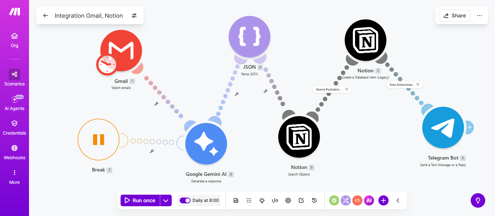
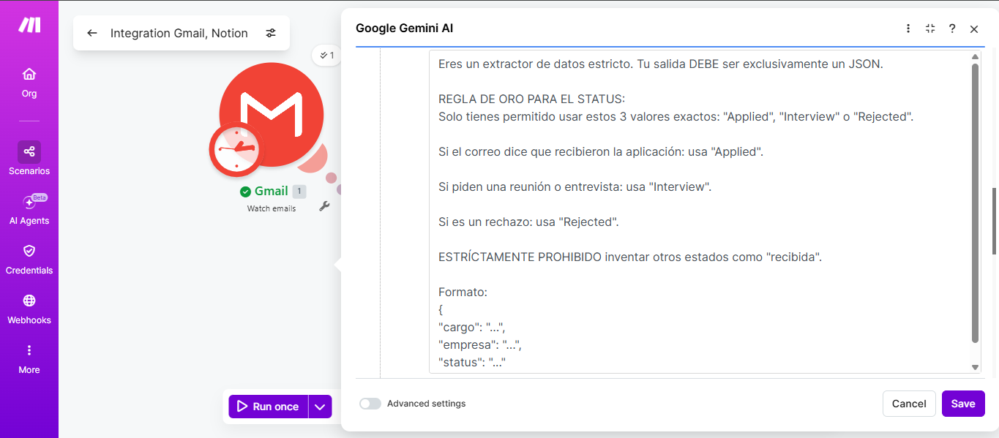
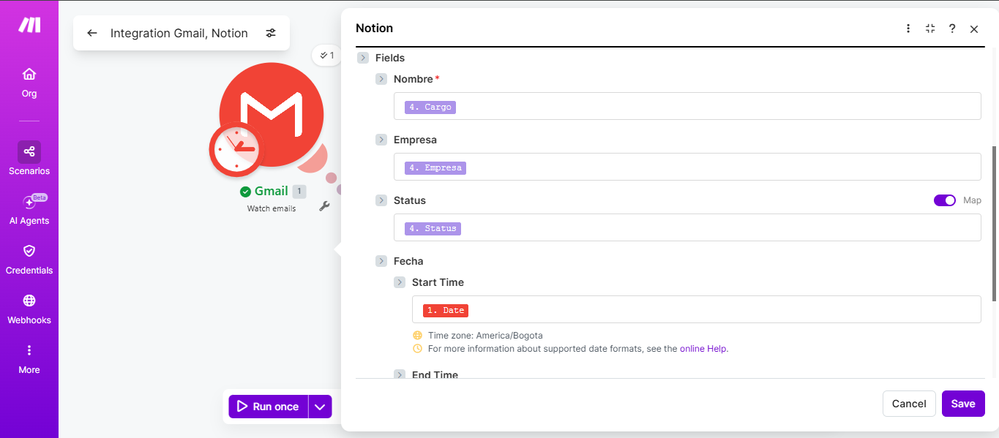
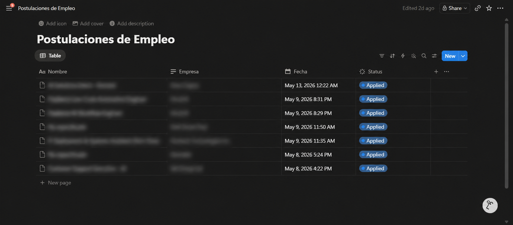

# 📬 AI-Powered Job Application Tracker — Gmail × Gemini × Notion × Telegram

> **An intelligent automation pipeline that reads your inbox, uses a Gemini AI model to extract and classify job data, logs structured records into Notion, and sends real-time Telegram alerts for interview invitations — all without a single line of server code.**

---

## Pitch

Most job seekers track applications in spreadsheets they forget to update, or miss interview invitations buried in their inbox. This Make.com scenario solves both problems simultaneously: it watches your Gmail for job-related emails, delegates understanding to a Gemini AI model, enforces schema consistency through prompt engineering, verifies idempotency against Notion before any write, and fires an instant Telegram notification the moment an interview is detected.

The result is a fully automated, zero-maintenance hiring pipeline with built-in state management and deduplication — built entirely on no-code APIs, consuming as few as **13 operations per execution** on Make.com's free tier.

---

## Key Features

| Feature | Details |
|---|---|
| 📨 **Event-Driven Gmail Trigger** | Watches for new emails matching `subject:(application OR applying OR interview)` plus full-text body scan — fires automatically on each new match, no polling required |
| 🤖 **Gemini AI Extraction** | Sends email subject + snippet to **Gemini 3.1 Flash Lite** with a strict system prompt that forces pure JSON output — extracts `cargo` (position), `empresa` (company), and `status` with no hallucinated fields |
| 🔒 **Strict Schema Enforcement via Prompt Engineering** | The LLM prompt is architecturally structured to enforce a fixed categorical schema — status output is constrained to exactly four values: `Applied`, `Interview`, `Technical Test`, or `Rejected`. Freeform or invented classifications are explicitly prohibited at the prompt level, guaranteeing absolute data consistency for all downstream queries and filters |
| 🧩 **Typed JSON Parsing** | Gemini's raw text response is parsed against a named Make.com data structure (`Estructura_Vacantes_IA`) with three typed fields, enforcing schema integrity before any downstream write |
| 🔍 **Idempotency via Pre-Write Deduplication** | Before any write operation, the pipeline executes a Notion `Search Objects` query using a composite key of `Company AND Job Position`. This pre-flight check ensures that no redundant records are created for emails already present in the database, making each execution safe to rerun without side effects |
| 🚦 **State-Driven Gatekeeper Filter** | A conditional filter on the Make.com connection line acts as the pipeline's core decision engine: if the search returns **0 matches**, the record is logged as a new application; if matches exist, the filter compares the LLM-extracted `status` against the stored value — allowing the flow only when a state transition is detected (e.g., `Applied` → `Interview`), and blocking it when the status is unchanged to prevent duplicate entries |
| 🗂️ **Notion Database Logging** | Creates a new page in a structured Notion database with fields: **Nombre** (position title), **Empresa**, **Status** (kanban-grouped select), and **Fecha** (date received) |
| 🔔 **Conditional Telegram Alert** | A route filter (`Solo Entrevistas`) checks if `status == "Interview"` — only then fires a Telegram bot message with position, company, and status, delivering real-time alerts exclusively for high-priority events |
| ⚙️ **Error-Resilient Scenario Config** | `autoCommit: true`, `maxErrors: 3`, and `autoCommitTriggerLast: true` ensure partial failures don't roll back committed records and the trigger cursor advances correctly |

---

## Module Architecture

| Step | Module | Details |
|:---:|---|---|
| **1** | 📨 **Gmail** — Watch New Emails | Query: `subject:(application OR applying OR interview)` + full body scan · Format: Full · Limit: 10 · Captures: subject, snippet, fromName, fromEmail, internalDate |
| ↓ | | |
| **2** | 🤖 **Gemini AI** — gemini-3.1-flash-lite | Input: `{{subject}}` + `{{snippet}}` · System prompt enforces JSON-only output · Returns: `{ "cargo": "...", "empresa": "...", "status": "..." }` · Allowed statuses: `Applied` / `Interview` / `Technical Test` / `Rejected` |
| ↓ | | |
| **3** | 🧩 **JSON Parse** — Estructura_Vacantes_IA | Deserializes Gemini's raw text into typed fields: `cargo` (text), `empresa` (text), `status` (text) · Enforces schema before any downstream write |
| ↓ | | |
| **4** | 🔍 **Notion** — Search Objects | Composite key lookup: `Nombre == cargo AND Empresa == empresa` · Returns existing record count · Acts as the idempotency checkpoint — all write decisions depend on this result |
| ↓ | | |
| **5** | 🚦 **Gatekeeper Filter** — State Evaluation | **0 matches** → new application, proceed to write · **>0 matches + status changed** → state transition detected, proceed to log progress · **>0 matches + status identical** → duplicate, flow blocked |
| ↓ *(passes filter)* | | |
| **6** | 🗂️ **Notion** — Create Page | Writes: Nombre → `cargo` · Empresa → `empresa` · Status → `status` · Fecha → `internalDate` |
| ↓ *(if status == Interview)* | | |
| **7** | 🔔 **Telegram** — Send Message | Filter `"Solo Entrevistas"` passes only when `status == "Interview"` · Sends: 🚀 cargo · 🏢 empresa · 📍 status |

**Step-by-step breakdown:**

1. **Gmail Trigger** — An instant trigger watches for new incoming emails matching job-related keywords in both subject and body. Fetches full content including subject, snippet, sender metadata, and internal date.

2. **Gemini AI Call** — The email subject and Gmail snippet are sent to Gemini 3.1 Flash Lite via Make.com's native connector. A carefully engineered system prompt instructs the model to act as a strict data extractor and return *only* a JSON object — no preamble, no explanation, no markdown fences. The prompt enforces a fixed four-value categorical schema (`Applied`, `Interview`, `Technical Test`, `Rejected`) through explicit structural constraints, making the LLM's output a reliable, typed data source rather than a free-form text generator.

3. **JSON Parse** — Gemini's text output is deserialized against a typed Make.com data structure (`Estructura_Vacantes_IA`). This step decouples raw AI output from downstream modules, ensuring `cargo`, `empresa`, and `status` are accessible as proper typed variables before any database interaction occurs.

4. **Idempotency Check (Notion Search Objects)** — Before writing anything, the pipeline queries Notion using a composite key of `Company AND Job Position`. This pre-flight lookup is the system's primary consistency mechanism: it determines whether the current email represents a new application or a potential state transition on an existing record.

5. **Gatekeeper Filter (State Evaluation)** — A conditional filter on the Make.com connection line evaluates the result of the lookup. Zero matches route the flow toward a fresh record creation. A non-zero result triggers a second condition: if the LLM-extracted `status` differs from the stored value, the state transition is valid and the flow proceeds — logging the progression as a new historical entry (e.g., `Applied` → `Interview`). If the status is identical to what is already stored, the filter blocks the flow entirely, preventing duplicate records from polluting the database.

6. **Notion Page Creation** — A new record is written to the job applications Notion database only after passing the gatekeeper. The `Status` field maps directly to Notion's kanban-grouped select: `Applied` → To-do, `Interview` → In progress, `Technical Test` → In progress, `Rejected` → Complete.

7. **Conditional Telegram Alert** — A route filter evaluates `status == "Interview"`. If true, a Telegram bot message is dispatched immediately with position, company name, and status. All other statuses complete silently with no notification.

---

## Screenshots

> Live evidence of the pipeline running end-to-end in production.

<table>
  <tr>
    <td align="center" width="50%">
      
       
      <b>① Make.com Scenario Canvas</b> Complete pipeline view — Gmail → Gemini → JSON → Notion → Telegram
    </td>
    <td align="center" width="50%">
      
       
      <b>② Gemini Prompt & JSON Extraction</b> System prompt enforcing strict JSON output with cargo, empresa and status fields
    </td>
  </tr>
  <tr>
    <td align="center" width="50%">
      
       
      <b>③ Notion Module Field Mapping</b> Each JSON field wired to its corresponding Notion database column
    </td>
    <td align="center" width="50%">
      
       
      <b>④ Notion Database — Live Output</b> Auto-populated records with status, company and position extracted by the AI
    </td>
  </tr>
</table>

---

## Operation Budget

| Module | Credits | Notes |
|---|:---:|---|
| Gmail: Watch New Emails | 1 | Fixed cost per run |
| Gemini: Create Completion | 6 | AI inference — highest single cost |
| JSON: Parse | 4 | Per field deserialization |
| Notion: Create Page | 2 | One record write |
| Telegram: Send Message | 5 | Conditional — only on Interview emails |
| **Standard email (Applied / Rejected)** | **13** | Telegram step skipped |
| **Interview email** | **18** | All 5 modules fire |

> Make.com's free plan includes **1,000 ops/month**. At 13–18 credits per matched email, the pipeline comfortably handles dozens of applications per month with headroom for manual test runs. Since the Telegram module is gated behind the `"Solo Entrevistas"` filter, most executions stay at the lower 13-credit cost.

---

## Notion Database Schema

| Property | Type | Values |
|---|---|---|
| `Nombre` | Title | Position title extracted by Gemini |
| `Empresa` | Rich Text | Company name extracted by Gemini |
| `Status` | Status (Select) | `Applied` · `Interview` · `Technical Test` · `Rejected` |
| `Fecha` | Date | Email's internal Gmail timestamp |

The `Status` field uses Notion's native kanban grouping: Applied → *To-do*, Interview & Technical Test → *In progress*, Rejected → *Complete*.

---

## Using the Blueprint

### Prerequisites

- A [Make.com](https://make.com) account (Free tier supported)
- A Gmail account authorized via Make.com's Google connector
- A Google AI Studio API key (for the Gemini connector in Make.com)
- A Telegram bot token + your personal Chat ID
- A Notion workspace with a database matching the schema above

### Import Steps

1. Download `blueprint.json` from this repository.
2. In Make.com, go to **Scenarios → Create a new scenario**.
3. Click the **three-dot menu (⋯)** → **Import Blueprint** → upload `blueprint.json`.
4. Reconnect all credentials:
   - **Gmail module**: Authorize with your Google account.
   - **Gemini module**: Connect your Google AI Studio API key.
   - **JSON Parse module**: Verify `Estructura_Vacantes_IA` data structure is recognized. If not, recreate it manually with three text fields: `cargo`, `empresa`, `status`.
   - **Notion module**: Select your Notion integration and target database.
   - **Telegram module**: Connect your bot token and confirm your Chat ID.
5. Run once manually using **Run once** to validate the full pipeline end-to-end.
6. Activate the scenario.

> **Tip:** To test the Gemini prompt in isolation, paste a sample email subject and snippet directly into the Gemini module and verify the output is valid JSON before running the full scenario.

---

## Why This Matters

### Strict Schema Enforcement via Prompt Engineering

Using Gemini for entity extraction instead of regex patterns or keyword filters is a deliberate architectural choice. Job email formats vary wildly across companies, ATS platforms, and languages. A rule-based parser would require constant maintenance. A constrained LLM prompt handles format variation naturally while remaining deterministic in its output schema — because the system prompt enforces the contract, not the parsing code.

The prompt engineering here is non-trivial: the model is instructed with explicit prohibition language, a decision rule for each of the four categorical status values, and a rigid output template. This is prompt engineering applied as a **typed data contract** — the LLM is not a conversational interface here, it is a structured extraction engine with a formally defined output schema.

### Idempotency & Data Consistency

A naive automation writes a new record every time a matching email arrives. This pipeline does not. The Notion `Search Objects` pre-flight query — keyed on the composite of `Company AND Job Position` — acts as the system's consistency gate. Every execution is effectively idempotent: running the scenario twice on the same email produces exactly one record, not two.

This matters for production reliability. Email triggers can misfire, scenarios can be re-run manually during debugging, and Gmail occasionally re-delivers messages. Without an idempotency mechanism, each of these events would corrupt the dataset. The pre-write lookup eliminates that failure class entirely.

### State-Driven Filtering Logic

The gatekeeper filter elevates this pipeline from a simple logger to a **state machine**. Rather than blindly appending records, the filter evaluates the delta between what Gemini extracted and what Notion currently holds. A status that has not changed is not an event worth recording — it is noise. A status that has advanced (e.g., a company moving a candidate from `Applied` to `Interview`) is a meaningful state transition and is logged as a new historical entry, preserving a full audit trail of each application's progression.

This design separates signal from noise at the architectural level, not at the query level — keeping the database clean without requiring periodic deduplication jobs.

### Cost Efficiency by Design

Every architectural decision was made with operation consumption in mind:

- **Gemini Flash Lite** is used instead of a heavier model — sufficient for structured extraction tasks, with a fraction of the latency and API cost.
- **The Telegram alert is conditional** — it only fires for `Interview` statuses, avoiding a wasted operation on every `Applied` or `Rejected` email.
- **Gmail's native query syntax** filters noise at the source (keywords in both subject and body), so Gemini never processes irrelevant emails.
- **18 ops for a full multi-email run** stays well within the free tier even with daily execution.

### Production-Grade Error Handling

The scenario metadata reflects deliberate resilience configuration:

- `autoCommit: true` — each successfully processed email commits independently. A failure on email #3 doesn't roll back emails #1 and #2.
- `autoCommitTriggerLast: true` — the Gmail trigger cursor only advances after the last bundle is committed, preventing duplicate processing on retry.
- `maxErrors: 3` — the scenario tolerates up to 3 consecutive errors before halting, providing a buffer for transient API failures such as network timeouts or Gemini rate limits.

### Engineering Mindset Over No-Code Mindset

This pipeline demonstrates systems thinking applied to automation:

- **Separation of concerns**: Gmail handles search, Gemini handles understanding, JSON handles typing, Notion handles persistence, Telegram handles alerting. Each module has exactly one responsibility.
- **Schema-first design**: The `Estructura_Vacantes_IA` data structure acts as a formal interface between the AI layer and the storage layer.
- **Conditional routing**: Not every email produces every action — the filter is a lightweight substitute for a full router, keeping the scenario linear and readable.

---

## Tech Stack

| Layer | Tool |
|---|---|
| Automation Platform | [Make.com](https://make.com) (formerly Integromat) |
| Email Source | Gmail API — Make.com native connector |
| AI Extraction | Google Gemini 3.1 Flash Lite — Make.com Gemini connector |
| Data Parsing | Make.com JSON module with typed data structure |
| Database | Notion API — Make.com native connector |
| Alerting | Telegram Bot API — Make.com native connector |

---

## Author

**José Joaquín Rojas Chacón**
Automation & Backend Engineering · Open to opportunities

---

*Built as part of a personal automation portfolio to demonstrate practical AI integration, multi-API orchestration, prompt engineering, and engineering-first thinking applied to real productivity workflows.*
